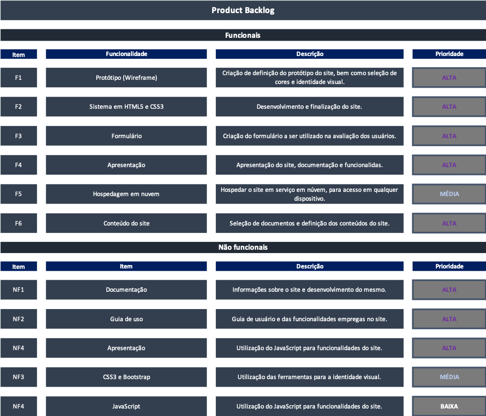

  

 

  

  

<a  href="#sobre">Sobre</a> |
<a  href="#backlogs">Product Backlog</a> |
<a  href="#user_stories">User Stories</a> |
<a  href="#tecnologias">Tecnologias</a> |
<a  href="#equipe">Equipe</a>

  

  

 

  

## :bookmark_tabs: Sobre o projeto

  

Este projeto tem como objetivo fornecer uma plataforma educacional abrangente dedicada à metodologia ágil Scrum. Com a crescente demanda por abordagens ágeis no desenvolvimento de software e gerenciamento de projetos, nossa missão é oferecer um recurso valioso para indivíduos e equipes que desejam aprender e implementar o Scrum de maneira eficaz.

  

>  _Projeto baseado na metodologia ágil SCRUM, procurando desenvolver a Proatividade, Autonomia, Colaboração e Entrega de Resultados dos estudantes envolvidos_   

 

:arrow_right: Status do Projeto: **Concluído** ✅

 

Para ter acesso ao site finalizado, **clique** [aqui!](https://innocodesolutions.github.io/innoCodeSolutions/index.html)

 

 

  

### 🏁 Entregas de Sprints

  

Cada entrega será realizada a partir da **data de conclusão**, além da criação de um readme.md neste repositório com um relatório completo de tudo o que foi desenvolvido naquela sprint. Observe a relação a seguir:

| Sprint | Previsão de entrega | Status | Histórico |
|:--:|:----------:|:-------------------|:-------------------------------------------------:|
| 01 | 28/09/2023 | ✅ Concluído |[Relatório](sprint01_relatório.md)
| 02 | 26/10/2023 | ✅ Concluído |[Relatório](sprint02_relatório.md)
| 03 | 23/11/2023 | ✅ Concluído |[Relatório](sprint03_relatório.md)

   

 
  

:movie_camera: Vídeo sobre a 1ª sprint <a href="https://youtu.be/G6foH98PoDM">aqui</a>

Para ter acesso ao projeto do site acesse o passo a passo <a href="https://github.com/InnoCodeSolutions/documentacao_InnoCodeSolutions/blob/main/GUIA%20DE%20ACESSO%20À%20PROTÓTIPO.pdf">aqui</a>

 

  
→ [Voltar ao topo](#topo)

 

 

  

  

## :dart: Product Backlog

  

  

  

  

→ [Voltar ao topo](#topo)

  

 

 

## :scroll: User Stories

→ [Voltar ao topo](#topo)

 

  

  

## 🛠️ Tecnologias

  

As seguintes ferramentas, linguagens, bibliotecas e tecnologias foram usadas na construção do projeto:

  

  

  

  

  

  

  

  

  

  

→ [Voltar ao topo](#topo)

  

 

  

  

## :busts_in_silhouette: Equipe

  

| Função | Nome | LinkedIn & GitHub |
| :---------:| :--------: | :---------------------: |
| Product Owner | Mauro do Prado Santos |   |
| Scrum Master | Gustavo Carvalho |   |
| Dev Team | Lucas Silva Cambuzano |   |
| Dev Team | Lucas Lahos Sanchez |   |
| Dev Team | Danilo Alves dos Santos Braz |   |
| Dev Team | Jucielinton Souza Mello Pedro |  |
| Dev Team | João Paulo Epifano dos Santos |  |
| Dev Team | André Flávio de Oliveira |  |

 

 

→ [Voltar ao topo](#topo)
