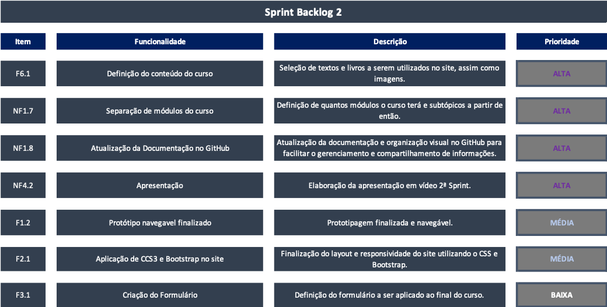
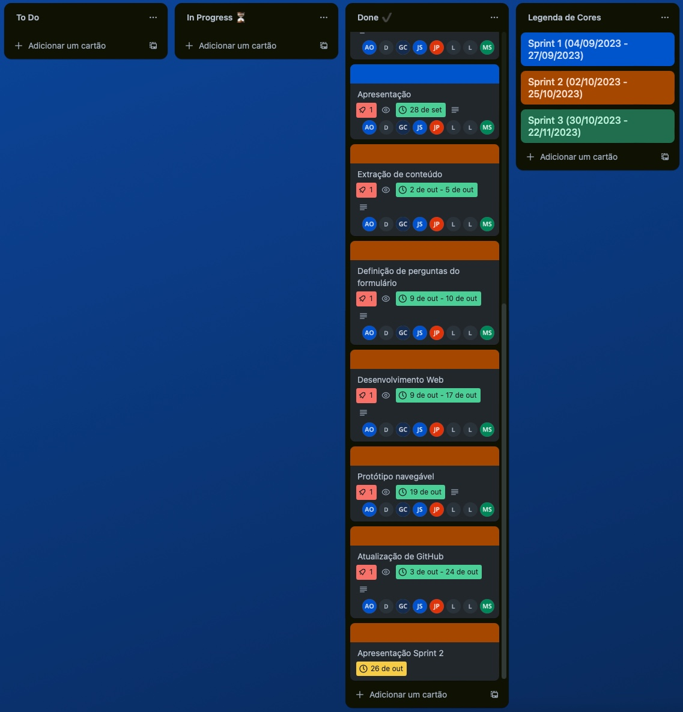
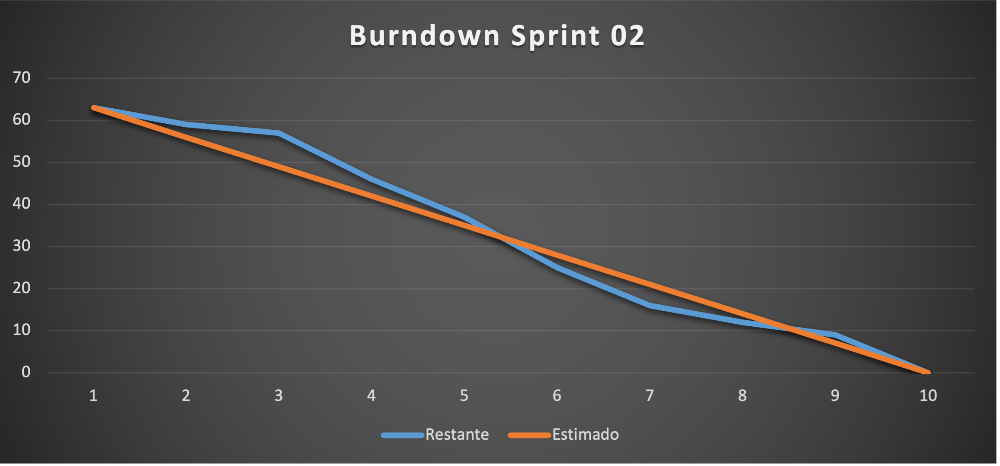

  

<h1  align="center">Sprint 2: 02/10/2023 a 26/10/2023</h1>

<a  href="#objetivos">Objetivos da sprint</a> &nbsp |&nbsp &nbsp
<a  href="#entregas">Entregas</a> &nbsp |&nbsp &nbsp
<a  href="#sprint_backlog">Sprint Backlog 1</a> &nbsp |&nbsp &nbsp
<a  href="#kanban">KanBan</a> &nbsp |&nbsp &nbsp 
<a  href="#prototipo">Protótipo</a> &nbsp |&nbsp &nbsp 
<a  href="#metricas">Métricas do time</a>

&nbsp |&nbsp <a  href="#sprint_retrospectiva"> Sprint Retrospectiva</a>&nbsp |&nbsp &nbsp

<a href="https://github.com/InnoCodeSolutions/documentacao_InnoCodeSolutions.git">Voltar para Documentação<a>
 

  

Para a sequencia do desenvolvimento do um site, durante esta segunda sprint, nossa equipe concentrou seus esforços no desenvolvimento do Site em HTML, CSS e Bootstrap. Que terá como o principal objetivo a criação do site navegável.

   

## :dart: Objetivos da Sprint

Os requisitos (tanto do cliente como da instituição de ensino) abrangidos por essa sprint são:

  

- :heavy_check_mark: **1:** Definição do conteúdo do curso;

- :heavy_check_mark: **2:** Aplicação de CCS3 e Bootstrap no site;

- :heavy_check_mark: **3:** Separação de módulos do curso;

- :heavy_check_mark: **4:** Criação do Formulário;

- :heavy_check_mark: **5:** Atualização da Documentação no GitHub;

- :heavy_check_mark: **6:** Protótipo navegavel finalizado;

- :heavy_check_mark: **7:** Apresentação.

 

## 📲 Entregas

Para entregas da sprint, tivemos os artefatos SCRUM validados, como Backlog do Produto, Backlog da Sprint 02, através de comunicação direta entre o P.O. e o cliente. 
  

### 1: Definição do conteúdo do curso

  

Seleção de textos e livros a serem utilizados no site, assim como imagens.
  

### 2: Aplicação de CCS3 e Bootstrap no site

Finalização do layout e responsividade do site utilizando o CSS e Bootstrap.

### 3: Separação de módulos do curso

Definição de quantos módulos o curso terá e subtópicos a partir de então.

### 4: Criação do Formulário

Definição do formulário a ser aplicado ao final do curso. 

### 5: Atualização da Documentação no GitHub

Atualização da documentação e organização visual no GitHub para facilitar o gerenciamento e compartilhamento de informações.

### 6: Protótipo navegavel finalizado

Prototipagem finalizada e navegável.

### 7: Apresentação

Elaboração da apresentação em vídeo 2ª Sprint.

→ [Voltar ao topo](#topo)

  

## :clipboard: Sprint Backlog 2

A Sprint Planning foi realizada no dia 02/10/2023, gerou os artefatos para o backlog abaixo:

      
       

→ [Voltar ao topo](#topo)

 

##  :bar_chart: KanBan

      
       

→ [Voltar ao topo](#topo)

 

## :computer: Protótipo

Para ter acesso ao protótipo navegável e não finalizado basta clicar <a href="https://github.com/InnoCodeSolutions/innoCodeSolutions/tree/develop">aqui.</a>

→ [Voltar ao topo](#topo)

 

## :chart_with_upwards_trend: Métricas do time

Nesta sprint o time se uniu para as entregas de cada item listado na backlog da sprint.

- Abaixo se encontra o gráfico Burndown gerado pela equipe nesta sprint, onde o eixo X são os dias trabalhados e o eixo Y representa as entregas de cada dia:

  → Para ter acesso a planilha com os dados e gráfico clique <a href="https://fatecspgov-my.sharepoint.com/:x:/g/personal/gustavo_carvalho21_fatec_sp_gov_br/EYHhekfCCWVGjcrbAh9dUcMBErhKBofVpfHzoNdkV9C2jg?e=kDRqlZ&nav=MTVfezAwMDAwMDAwLTAwMDEtMDAwMC0wMDAwLTAwMDAwMDAwMDAwMH0">aqui!</a> e selecione a aba correspondente.

→ [Voltar ao topo](#topo)

 

## :bulb: Sprint Retrospectiva

- ### O que funcionou bem?
  - Divisão de tarefas e realização das mesmas;
  - Atualização e organização da documentação no GitHub.
  
- ### O que pode melhorar?
  - Dificuldades para implementar o Bootstrap ao site;
  - Dificuldades em definir conteúdo do site; 
  - Melhorar a comunicação da equipe;
  - Cumprir os prazos estipulados para cada tarefa;

→ [Voltar ao topo](#topo)
